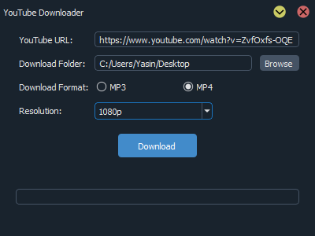

# YouTube Downloader

A simple YouTube downloader GUI built with PyQt5 and pytube.

## Table of Contents

- [Introduction](#introduction)
- [Features](#features)
- [Requirements](#requirements)
- [Installation](#installation)
- [Usage](#usage)
- [Contributing](#contributing)
- [License](#license)

## Introduction

The YouTube Downloader is a graphical user interface (GUI) application that allows you to download videos or audio from YouTube. It provides a convenient way to select the desired video resolution and download format (MP3 or MP4). The application is built using PyQt5 for the GUI and pytube library for YouTube video/audio downloads.



## Features

- Download YouTube videos or audio in MP3 or MP4 format.
- Choose the desired video resolution (available for MP4 downloads).
- Progress bar to track the download progress.

## Requirements

- Python 3.x
- PyQt5
- pytube

## Installation

1. Clone the repository:
      ```bash
      git clone https://github.com/YasinOkat/YoutubeDownloader.git
      
2. Change to the project directory:
      ```bash
      cd YoutubeDownloader

## Usage

1. Run the application:

      ```bash
      python youtube-downloader.py
      

2. Enter the YouTube URL of the video you want to download.
3. Select the download folder by clicking the "Browse" button.
4. Choose the download format (MP3 or MP4) and the desired video resolution (for MP4 downloads).
5. Click the "Download" button to start the download.
6. The download progress will be displayed in the progress bar.
7. Once the download is completed, the status will be shown, and the downloaded file will be saved in the specified folder.

## Contributing

Contributions are welcome! If you find any issues or have suggestions for improvement, please open an issue or submit a pull request.

## License

This project is licensed under the GNU General Public License (GPL). See the [LICENSE](LICENSE) file for more information.

